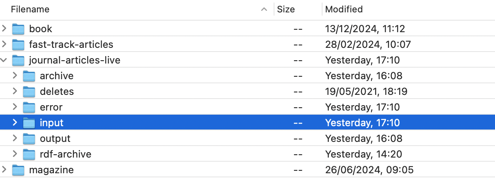

# Loading

To add new content to AUP Online, content is uploaded to the [SFTP](sftp.md). Below is described how.

## journals
Journals are loaded per issue. Issues are packaged as follows:

1. Content for an issue must be sent in a single zip file to the specified SFTP location.
2. The name of the zip and files within the zip must consist of alphanumeric characters and must not contain spaces or special characters.
3. All articles supplied within an issue zip file must belong to the same issue.
4. Names of all files supplied within a zip file must be unique, even if they are supplied within folders in the zip file.
5. The names of image files and PDF files supplied within the XML must exactly match the file names of the supplied files within the zip. The file names within the XML must not contain folder names and must be provided with the extensions.

## conference proceedings
1. Content for a proceeding must be sent in a single zip file to the specified SFTP location.
2. The name of the zip and files within the zip must consist of alphanumeric characters and must not contain spaces or special characters.
3. All papers supplied within a zip file must belong to the same proceeding.
4. Names of all files supplied within a zip file must be unique, even if they are supplied within folders in the zip file.
5. The names of image files and PDF files supplied within the XML must exactly match the file names of the supplied files within the zip.
6. The file names within the XML must not contain folder names and must be provided with the extensions. 

## magazines

## books

1. Content for a book must be sent in a single zip file to the specified SFTP location.
2. The content loading pipeline accepts either a zip file for a book with one XML file for the book and chapters with supporting PDFs, images etc. OR one XML file per chapter with the supporting PDFs, images etc. A combination of the two is not supported. 
3. All chapters supplied within a zip file must belong to the same book.
4. The name of the zip and files within the zip must be one word without spaces.
5. If the files within the zip are supplied within folders, the file names must be unique across the zip.
6. Names of all the files within a zip must be unique.

## sftp
SFTP is a secure way of transferring files from a computer to a server. This is how AUP content and metadata is uploaded to AUP Online. There is an SFTP connection for the QA server and one for the Production server ("live site").

#### prod
There are four folders on the prod SFTP:

- books
- fast-track-articles
- journals-articles-live
- magazine

See [SFTP](sftp.md)
